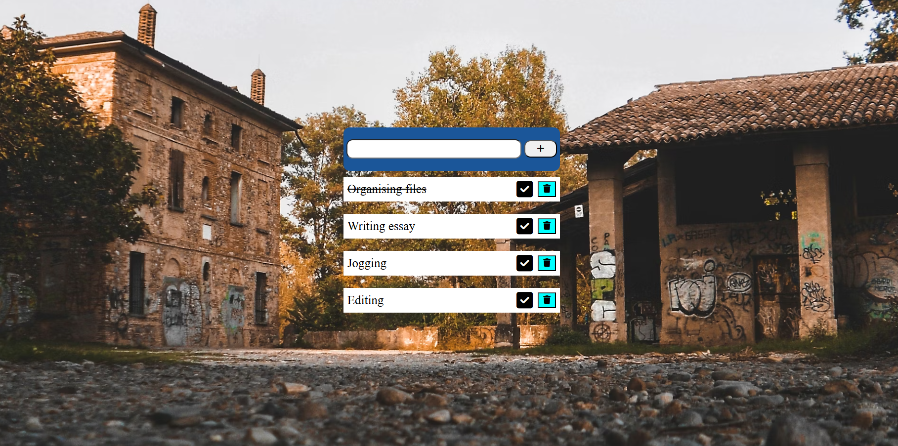

# To-do-list

A simple task list application that allows users to add, check, and delete tasks. This project uses HTML, CSS, and JavaScript. 

## Features
- Add tasks
- Mark tasks as completed
- Delete tasks
- Button with hover effects
- Responsive design for every screen

## Table of Contents

- [Demo](#demo)
- [Links](#links)
- [Built with](#built-with)
- [What I learned](#what-i-learned)
- [Author](#author)

## Demo

## Links
- URL : [Live Project](https://abhi1226l.github.io/To-do-list/)

## Built with

- Semantic HTML5 markup
- CSS custom properties
- Flexbox
- DOM
- ClassList
- CreateElement

## What I learned

I learned how to use CSS properties such as `background-size`, `background-position`, `transition`, `flex`, and `margin` in conjunction with JavaScript for creating new elements and managing class lists.

 ## Author

- Name - Abhishek

